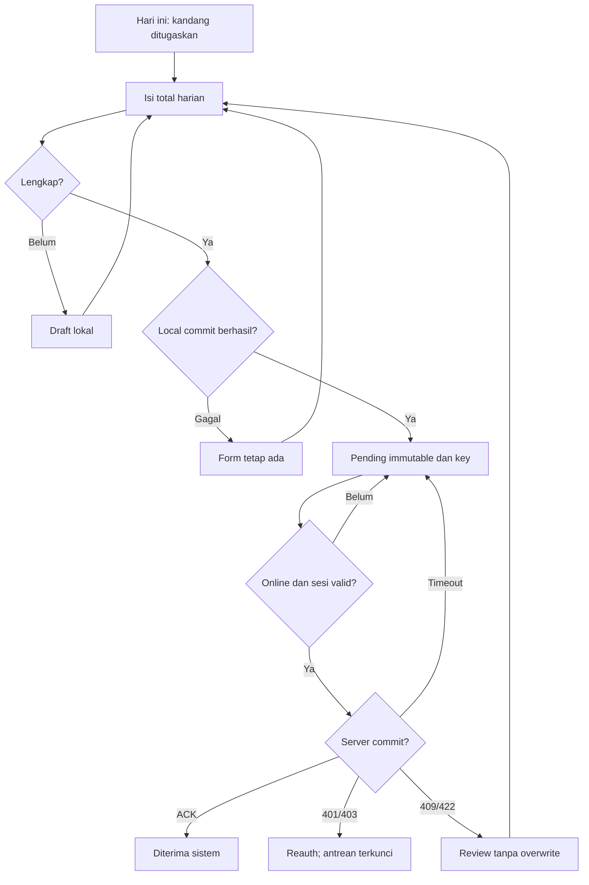

# F-03

Source `contracts/flows.json`; SHA-256 `44dfca967d2ee95e1325f38c5fbf27ccdb89f3205c77cbcf6c45bb404aebe035`. Generated by scripts/generate_diagrams.py.

```mermaid
flowchart TD
  A[Hari ini: kandang ditugaskan] --> B[Isi total harian]
  B --> C{Lengkap?}
  C -->|Belum| D[Draft lokal]
  D --> B
  C -->|Ya| E{Local commit berhasil?}
  E -->|Gagal| F[Form tetap ada]
  F --> B
  E -->|Ya| G[Pending immutable dan key]
  G --> H{Online dan sesi valid?}
  H -->|Belum| G
  H -->|Ya| I{Server commit?}
  I -->|ACK| J[Diterima sistem]
  I -->|Timeout| G
  I -->|401/403| K[Reauth; antrean terkunci]
  I -->|409/422| L[Review tanpa overwrite]
  L --> B
```
