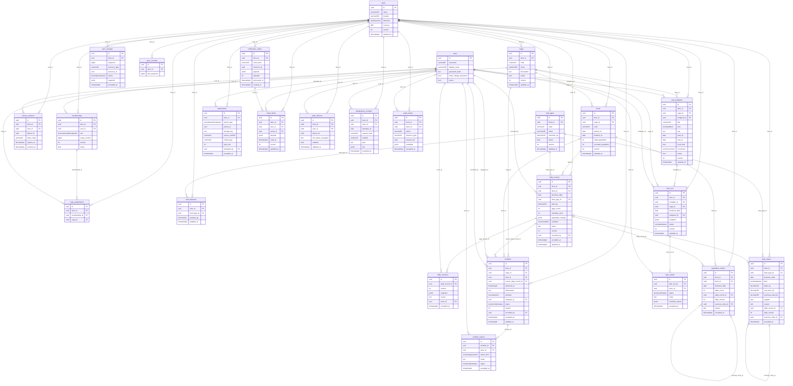

# Model data TERNAVA

Source `contracts/schema.json`; SHA-256 `f7c0e5212ab31a794b509698127ee351ca97ccddde32c7030a3667434357a697`. Generated by scripts/generate_diagrams.py.

```mermaid
erDiagram
  farms {
    uuid id PK
    varchar100 name
    varchar200 location
    ianatimezone timezone
    IDR currency
    int version
    timestamptz updated_at
  }
  users {
    uuid id PK
    varchar80 username
    varchar100 display_name
    text password_hash
    bool must_change_password
    bool active
  }
  memberships {
    uuid id PK
    uuid farm_id FK
    uuid user_id FK
    enumowneradminoperator role
    bigint scope_version
    int version
    bool active
  }
  device_sessions {
    uuid id PK
    uuid farm_id FK
    uuid user_id FK
    uuid device_id
    varchar64 token_hash
    timestamptz expires_at
    timestamptz revoked_at
  }
  cages {
    uuid id PK
    uuid farm_id FK
    varchar32 code
    varchar100 name
    text description
    bool active
    int version
    timestamptz updated_at
  }
  cage_assignments {
    uuid id PK
    uuid farm_id FK
    uuid membership_id FK
    uuid cage_id FK
  }
  flocks {
    uuid id PK
    uuid farm_id FK
    uuid cage_id FK
    varchar32 code
    date placed_on
    date finished_on
    int initial_population
    int recorded_population
    int version
    timestamptz updated_at
  }
  feed_types {
    uuid id PK
    uuid farm_id FK
    varchar32 code
    varchar100 name
    decimal142 minimum_kg
    bool active
    int version
    timestamptz updated_at
  }
  feed_balances {
    uuid id PK
    uuid farm_id FK
    uuid feed_type_id FK
    decimal142 quantity_kg
    timestamptz updated_at
  }
  daily_records {
    uuid id PK
    uuid farm_id FK
    uuid flock_id FK
    date business_date
    uuid feed_type_id FK
    decimal142 feed_kg
    int eggs_count
    int mortality_count
    jsonb population_change
    enumcondition condition
    text notes
    int version
    uuid recorded_by FK
    timestamptz accepted_at
    timestamptz updated_at
  }
  daily_revisions {
    uuid id PK
    uuid daily_record_id FK
    int version
    jsonb snapshot
    text reason
    uuid actor_id FK
    timestamptz accepted_at
  }
  feed_entries {
    uuid id PK
    uuid farm_id FK
    uuid feed_type_id FK
    date business_date
    enumfeedentry kind
    decimal142 delta_kg
    decimal182 unit_price_idr
    decimal182 purchase_total_idr
    text supplier
    text reason
    uuid daily_record_id FK
    int daily_version
    uuid reverses_entry_id FK
    timestamptz accepted_at
  }
  population_entries {
    uuid id PK
    uuid farm_id FK
    uuid flock_id FK
    date business_date
    int delta_count
    uuid daily_record_id FK
    int daily_version
    uuid reverses_entry_id FK
    text reason
    timestamptz accepted_at
  }
  task_templates {
    uuid id PK
    uuid farm_id FK
    uuid cage_id FK
    uuid assignee_id FK
    varchar120 title
    enumtaskkind kind
    text sop
    date start_on
    date end_on
    time local_time
    enumrecurrence recurrence
    bool active
    int version
    timestamptz updated_at
  }
  task_runs {
    uuid id PK
    uuid farm_id FK
    uuid template_id FK
    uuid cage_id FK
    date business_date
    uuid assignee_id FK
    jsonb snapshot
    enumtaskstatus status
    int version
    timestamptz updated_at
  }
  task_results {
    uuid id PK
    uuid task_run_id FK
    uuid actor_id FK
    enumresultstatus status
    text notes
    jsonb checklist_values
    timestamptz accepted_at
  }
  incidents {
    uuid id PK
    uuid farm_id FK
    uuid cage_id FK
    uuid flock_id FK
    uuid source_daily_record_id FK
    timestamptz observed_at
    text observation
    enumattention attention
    uuid assignee_id FK
    enumincidentstatus status
    int version
    uuid recorded_by FK
    timestamptz accepted_at
    timestamptz updated_at
  }
  incident_actions {
    uuid id PK
    uuid incident_id FK
    uuid actor_id FK
    enumassignoraction action_kind
    text notes
    enumincidentstatus status
    timestamptz accepted_at
  }
  attachments {
    uuid id PK
    uuid farm_id FK
    enumattachmentparent parent_type
    uuid parent_id
    text storage_key
    varchar64 source_sha256
    varchar32 media_type
    int byte_size
    uuid uploaded_by FK
    timestamptz accepted_at
  }
  inbox_items {
    uuid id PK
    uuid farm_id FK
    uuid user_id FK
    uuid event_id FK
    jsonb payload
    timestamptz read_at
    int version
    timestamptz updated_at
  }
  push_devices {
    uuid id PK
    uuid farm_id FK
    uuid user_id FK
    uuid device_id
    text fcm_token_encrypted
    bool enabled
    timestamptz updated_at
  }
  idempotency_receipts {
    uuid id PK
    uuid farm_id FK
    uuid actor_id FK
    uuid operation_id
    varchar64 request_hash
    varchar10 method
    text path
    jsonb ack
    timestamptz accepted_at
  }
  sync_changes {
    uuid id PK
    uuid farm_id FK
    bigint sequence
    varchar40 resource_type
    uuid resource_id
    enumupsertremove action
    jsonb snapshot
    timestamptz accepted_at
  }
  sync_counters {
    uuid id PK
    uuid farm_id FK
    bigint last_sequence
  }
  audit_events {
    uuid id PK
    uuid farm_id FK
    uuid actor_id FK
    varchar80 action
    varchar40 resource_type
    uuid resource_id
    jsonb metadata
    timestamptz accepted_at
  }
  notification_outbox {
    uuid id PK
    uuid farm_id FK
    varchar40 event_kind
    uuid resource_id
    jsonb payload
    int attempts
    timestamptz processed_at
    timestamptz created_at
  }
  farms ||--o{ memberships : "farm_id"
  users ||--o{ memberships : "user_id"
  farms ||--o{ device_sessions : "farm_id"
  users ||--o{ device_sessions : "user_id"
  farms ||--o{ cages : "farm_id"
  farms ||--o{ cage_assignments : "farm_id"
  memberships ||--o{ cage_assignments : "membership_id"
  cages ||--o{ cage_assignments : "cage_id"
  farms ||--o{ flocks : "farm_id"
  cages ||--o{ flocks : "cage_id"
  farms ||--o{ feed_types : "farm_id"
  farms ||--o{ feed_balances : "farm_id"
  feed_types ||--o{ feed_balances : "feed_type_id"
  farms ||--o{ daily_records : "farm_id"
  flocks ||--o{ daily_records : "flock_id"
  feed_types ||--o{ daily_records : "feed_type_id"
  users ||--o{ daily_records : "recorded_by"
  daily_records ||--o{ daily_revisions : "daily_record_id"
  users ||--o{ daily_revisions : "actor_id"
  farms ||--o{ feed_entries : "farm_id"
  feed_types ||--o{ feed_entries : "feed_type_id"
  daily_records |o--o{ feed_entries : "daily_record_id"
  feed_entries |o--o{ feed_entries : "reverses_entry_id"
  farms ||--o{ population_entries : "farm_id"
  flocks ||--o{ population_entries : "flock_id"
  daily_records |o--o{ population_entries : "daily_record_id"
  population_entries |o--o{ population_entries : "reverses_entry_id"
  farms ||--o{ task_templates : "farm_id"
  cages ||--o{ task_templates : "cage_id"
  users ||--o{ task_templates : "assignee_id"
  farms ||--o{ task_runs : "farm_id"
  task_templates ||--o{ task_runs : "template_id"
  cages ||--o{ task_runs : "cage_id"
  users ||--o{ task_runs : "assignee_id"
  task_runs ||--o{ task_results : "task_run_id"
  users ||--o{ task_results : "actor_id"
  farms ||--o{ incidents : "farm_id"
  cages ||--o{ incidents : "cage_id"
  flocks |o--o{ incidents : "flock_id"
  daily_records |o--o{ incidents : "source_daily_record_id"
  users |o--o{ incidents : "assignee_id"
  users ||--o{ incidents : "recorded_by"
  incidents ||--o{ incident_actions : "incident_id"
  users ||--o{ incident_actions : "actor_id"
  farms ||--o{ attachments : "farm_id"
  users ||--o{ attachments : "uploaded_by"
  farms ||--o{ inbox_items : "farm_id"
  users ||--o{ inbox_items : "user_id"
  notification_outbox ||--o{ inbox_items : "event_id"
  farms ||--o{ push_devices : "farm_id"
  users ||--o{ push_devices : "user_id"
  farms ||--o{ idempotency_receipts : "farm_id"
  users ||--o{ idempotency_receipts : "actor_id"
  farms ||--o{ sync_changes : "farm_id"
  farms ||--o{ sync_counters : "farm_id"
  farms ||--o{ audit_events : "farm_id"
  users |o--o{ audit_events : "actor_id"
  farms ||--o{ notification_outbox : "farm_id"
```
