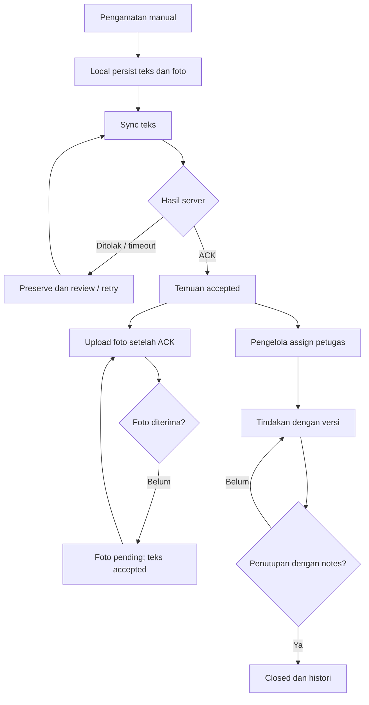

# F-06

Source `contracts/flows.json`; SHA-256 `44dfca967d2ee95e1325f38c5fbf27ccdb89f3205c77cbcf6c45bb404aebe035`. Generated by scripts/generate_diagrams.py.

```mermaid
flowchart TD
  A[Pengamatan manual] --> B[Local persist teks dan foto]
  B --> C[Sync teks]
  C --> D{Hasil server}
  D -->|Ditolak / timeout| E[Preserve dan review / retry]
  E --> C
  D -->|ACK| F[Temuan accepted]
  F --> G[Upload foto setelah ACK]
  G --> H{Foto diterima?}
  H -->|Belum| I[Foto pending; teks accepted]
  I --> G
  F --> J[Pengelola assign petugas]
  J --> K[Tindakan dengan versi]
  K --> L{Penutupan dengan notes?}
  L -->|Belum| K
  L -->|Ya| M[Closed dan histori]
```
