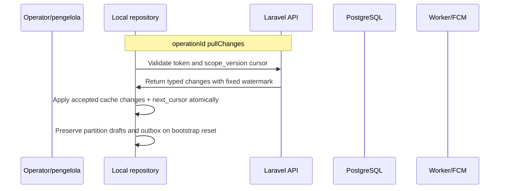

# pullChanges

Source `contracts/openapi.json`; SHA-256 `646efce529587771a823b28fa2026de3d38bb106dd8d66759e03083b9dc4ccee`. Generated by scripts/generate_diagrams.py.

```mermaid
sequenceDiagram
  participant U as Operator/pengelola
  participant L as Local repository
  participant A as Laravel API
  participant D as PostgreSQL
  participant W as Worker/FCM
  Note over L,A: operationId pullChanges
  L->>A: Validate token and scope_version cursor
  A->>L: Return typed changes with fixed watermark
  L->>L: Apply accepted cache changes + next_cursor atomically
  L->>L: Preserve partition drafts and outbox on bootstrap reset
```
